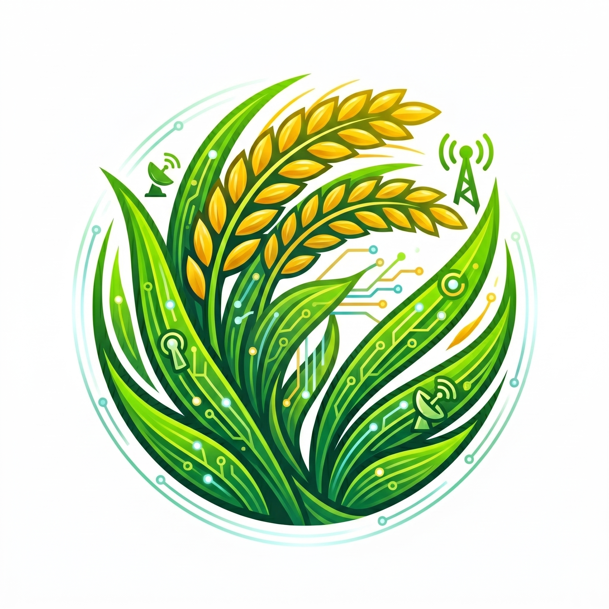

<div align="center">

  

  # 🌾 JOSI SmartPaDe

  **Platform Pertanian Cerdas Berbasis AI & Visualisasi 3D Interaktif**

   standardikasi solusi modern untuk membantu petani mendeteksi penyakit daun padi, mengoptimalkan penanganan, dan merencanakan waktu panen terbaik.

  ---

  [](https://reactjs.org/)
  [](https://www.typescriptlang.org/)
  [](https://vitejs.dev/)
  [](https://ai.google.dev/)

</div>

---

## 📖 Tentang Proyek

**JOSI SmartPaDe** (*Smart Paddy Leaf Disease Detection & Harvest Recommendation*) hadir untuk mendigitalisasi sektor pertanian padi. Menggabungkan teknologi **Kecerdasan Buatan (Google Gemini API)** dan **Visualisasi Model 3D Interaktif**, aplikasi ini memberikan analisa penyakit tanaman padi yang cepat, akurat, serta panduan perawatan terukur bagi para petani dan praktisi agrikultur.

---

## ✨ Fitur Utama

- 🔍 **Deteksi Penyakit Daun Padi (AI Analysis)**  
  Unggah foto daun padi yang bermasalah, dan sistem AI akan menganalisis indikasi penyakit serta memberikan opsi obat/solusi penangkalnya.
  
- 🌾 **Rekomendasi Waktu Panen**  
  Analisis kondisi fisik tanaman dan usia tanam untuk menentukan estimasi tanggal panen dengan bobot dan kualitas hasil yang optimal.

- 🧊 **Visualisasi Model 3D Interaktif**  
  Fitur interaktif 3D untuk memvisualisasikan struktur tanaman dan persebaran gejala penyakit secara visual dari berbagai sudut pandang.

- 💬 **Asisten Cerdas Pertanian**  
  Tanya jawab langsung dengan kecerdasan buatan seputar kendala tanam, pupuk, cuaca, dan tips perawatan padi harian.

---

## 🛠️ Teknologi yang Digunakan

| Kategori | Teknologi / Library |
| :--- | :--- |
| **Frontend Framework** | React.js dengan TypeScript |
| **Build Tool** | Vite |
| **AI Engine** | Google Gemini 1.5 Pro / Flash |
| **3D Rendering** | Three.js / React Three Fiber |
| **Styling** | Tailwind CSS |

---

## 🚀 Panduan Memulai

Ikuti langkah sederhana ini untuk menjalankan **JOSI SmartPaDe** di komputer lokal Anda:

### ⚙️ Prasyarat
- [Node.js](https://nodejs.org/) versi **20.0** atau yang lebih baru.
- NPM (otomatis terpasang bersama Node.js) atau PNPM.

---

### 📥 Langkah Instalasi

1. **Clone / Unduh Repositori**
   ```bash
   git clone [https://github.com/username/josi-smartpade.git](https://github.com/username/josi-smartpade.git)
   cd josi-smartpade